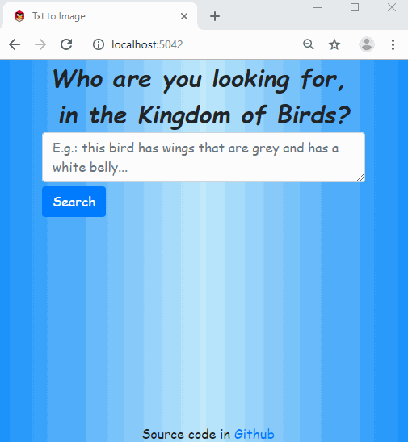
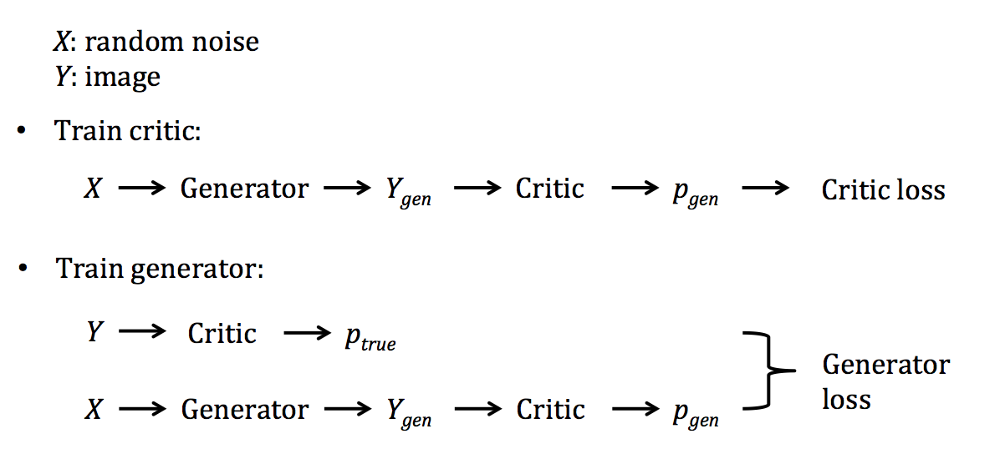
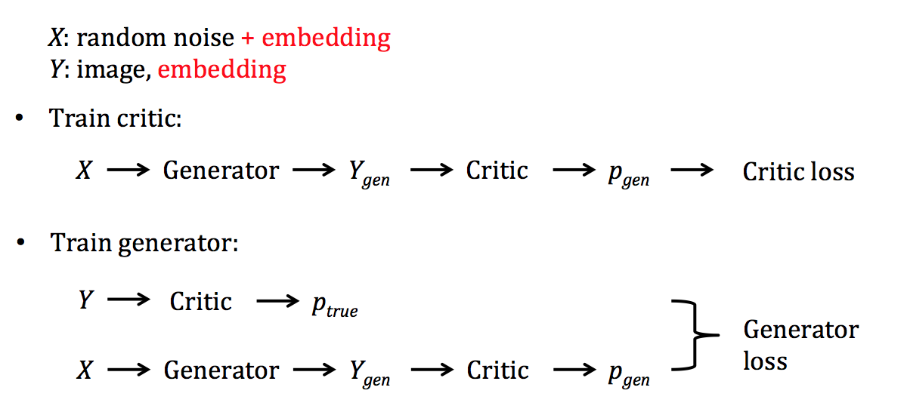
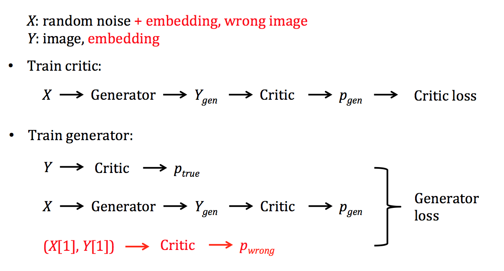

# Generate Images from Text Description

## Overview

This web app generates bird images from text descriptions:



Enter the descriptions for birds and click on "Search", nine (fake) birds images are generated and displayed. These fake images are generated by a GAN conditioned on the text. All the code for the app is under the `txt2img` folder. 

The heart of the app is the text encoding and the GAN model, which is under the `model` folder. The notebooks in this folder are:

`model/data.ipynb`: the dataset used for training is the [Caltech-UCSD Birds 200](http://www.vision.caltech.edu/visipedia/CUB-200.html) [3]. This notebook extracts, preprocesses and splits the hd5 dataset from [this repo](https://github.com/aelnouby/Text-to-Image-Synthesis). This makes it easier to use the [fastai](https://docs.fast.ai/) library. See the next section for the folder structure.

`model/lm.ipynb`: train a language model and a classifier for text encoding.

`model/gan.ipynb`: train a GAN that takes encoded description text to generate bird images.

`model/gan_noproj.ipynb`: same as above, slightly different neural network architecture.


## The Model

### Data
After running `model/data.ipynb`, the raw data has the following folder structure (under the `model` folder):
```
data/
+-- image/
|   +-- train/
|   +-- valid/
|   +-- test/
+-- txt/
|   +-- train/
|   +-- valid/
|   +-- test/
```

### Text Encoding

In here, a ULMFiT language model and a text classifier is used for text embedding. A language model is trained first, with all the description texts. Then the encoder part (AWD LSTM) is used to construct a text classifier, and the classifier is trained to classify different birds. Label smoothing is used in the classifier training. Finally, the encoder part is extracted and will be used for text embedding later.

The text encoding part in Ref. [1] is done by the authors' previous work [2]. In Ref. [2], the author fed the bird images (both right and wrong classes) together with the bird description texts to train a model. Then the encoder part of the model is used to encode bird description texts. Apparently the approach in Ref. [2] is more optimized for this specific problem. ULMFiT only takes information from the text, not the corresponding images.

### Image Generation

A GAN takes random noise as input and generates images. As W-GAN is used in here, I'll use the W-GAN terminology. To train the critic, the generator takes the input to generate a fake image, the feeds to the critic, which makes a prediction of this image being real, and calculates the loss. To train the generator, the critic takes a real image and makes prediction; the critic then takes a fake image and makes prediction; these two predictions are used to calculate the generator loss. This process is shown in the following figure:



In above, the input `X` is just random noise. Now we want to generate images according to the text, so we can feed both the noise and the embedding (just concatenate them) to the generator. We can also feed the embedding to the critic. So now the critic takes both image and the embedding to make prediction. I'll talk later about how the image and embedding are combined and fed to the critic (the code is in `Txt2ImgCritic`). This conditional GAN is summarized in the following figure:



Another improvement is to train with both correct and wrong images, which is called GAN-CLS in Ref. [1]. A "wrong" image is a real image, but the bird class is different from the class of the text description. The usual critic is trained to tell whether an image is real or fake, in here, we'd also like it to tell whether the image is of the same class of its text. So now during the training of the critic, a wrong image is fed as well and adds penalty in the loss (see `Txt2ImgLoss` for how the loss is calculated). The GAN-CLS is shown in the following figure:



### The Implementation with fastai

Both the text encoding and the GAN are implemented by using the [fastai](https://docs.fast.ai/) library. As the text embedding part is pretty standard and fastai already has a lot of documentations and examples, here I focus on the customization of the fastai's GAN module.  

Fastai provides unified API for different tasks. The GAN shown in Fig. 1 is supported by fastai, we just need to compare it with Fig. 2 and Fig. 3 to find out what we need to customize. 

#### The Data using fastai

We can see in Fig. 2, for both `X` and `Y`, we include the embedding as part of the data, so we have to customize the `ItemList`. The two class `Txt2ImgXItemList` and `Txt2ImgYItemList` are the customized `X` and `Y`. 

`Txt2ImgYItemList`: the `Y` item contains a tuple of a text embedding and the corresponding image. Usually the `Y` for GAN contains just image, in here the text embedding is fed to the critic as well, so we need this info in here.

`Txt2ImgXItemList`: the `X` item contains a tuple of a text embedding and a wrong image. Usually the `X` for GAN is just random noise, in here we need to have the text embedding. Why do we need the wrong image in here? Well, you can put it in either `X` or `Y`, we just need to be able to get it somewhere for the GAN-CLS training. This class contains some methods to select a wrong image (an image of different bird class).
The `Txt2ImgYItemList` is used as the `_label_cls`. In general, a data item has {X, Y}, and the `Y` is the "label" for `X`; in here, we don't really have "labels" and don't really care, but we still define the {X, Y} to be consistent.

#### The Models using fastai

Now we have the data, we need to change the default model behavior to use our data. As discussed above, we want the generator to take both the noise and the embedding, and returns both the generated image and the embedding (the critic will need image and the corresponding embedding to make prediction). We want the critic to take both the image and the embedding to make prediction. 

`Txt2ImgGenerator`: the generator. The embedding from fastai's UMLFiT has a size of 400, in here we map it to size of 128, and concatenate with a noise with size of 100. As discussed in Fig. 2, the generator returns a pair of embedding and fake image. 

`Txt2ImgCritic`: the critic. Usually the critic takes the image to get the prediction, in here, we insert the embedding before the prediction. The output of the `body` has a dimension of (512,4,4), we then take the projected embedding (128,1,1), repeat to make it (128,4,4), then concatenate with the `body`'s output. It's fed to the `head` to get the final prediction. Refer to Fig. 2 here and Fig. 2 of Ref. [1].

We need to customize the loss as well. By default, in the "generator" phase, output (from generator) and target (`Y`) are fed to calculate the loss; in the "critic" phase, real prediction (from critic) and input (`X`) are fed to calculate the loss. Because our `X` and `Y` are tuples now, we need to slightly modify how the data is fed. Also, we'd like to add one more term to the critic loss, if we use GAN-CLS.

`Txt2ImgLoss`: the customized loss function. 

Another modification is needed as the output from generator is a tuple: 

`Txt2ImgGANTrainer`: because the output of our customized generator contains the embedding as well and we just need to display the image, so we need to override the `on_backward_begin` method.

That's all we need to do.

## The App

### Usage

The web app is in the `txt2img` folder. It's ready to be delivered on as a Docker app to cloud providers, such as AWS Elastic Beanstalk or [Render](https://render.com/). To play with it on local server, install the requirements: 

```
pip install -r requirements.txt
```

Under the `/txt2img/` folder, start the server: 

```
python app/server.py serve
```

Open your browser and visit the website: 

`http://localhost:5042`

### How it works

The core code is in the `server.py` file. On start, it calls `setup_learner`, which downloads the model files and loads them. Two model files will be used in here: the `lm_export.pkl` for the text embedding, and the `gan_gen.pkl` for the GAN generator. Because I used my customized GAN generator, I will need to import that class as well. 

The `/` endpoint is for the index page. The `/gen_img` endpoint takes the description text then generates and returns 9 images. The images will be deleted after sending. The `/gen_img` endpoint will be called when clicking the button, see `static/app.js` for more details. 

# Next steps

Improve the model performance for text encoder and the GAN.

# Other

The website icon is from: http://www.iconarchive.com/

# References

[1] [Generative Adversarial Text-to-Image Synthesis](https://arxiv.org/abs/1605.05396)

[2] [Learning Deep Representations of Fine-grained Visual Descriptions](http://arxiv.org/abs/1605.05395)

[3] [Caltech-UCSD Birds 200](http://www.vision.caltech.edu/visipedia/CUB-200.html)
